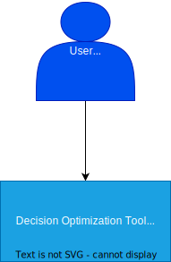

Context diagram
================

.. mermaid::
    :caption: Context diagram

    C4Context
        Enterprise_Boundary(b0, "Decision Modelling Process", "Process") {
            Person(person, "User", "A user of the Decision Model tool")
            Person(person2, "Decision Maker", "The decision maker of the project")
                System(system, "Decision Optimization Tool", "Tool to guide users through decision making processes.")
        }
        Rel(person, system, "Adds, edits, and visualizes the decision problem")
        Rel(person2, system, "View status and entered information of project approve steps")
        Rel(system, person2, "Provides basis for strucutured decision making")
